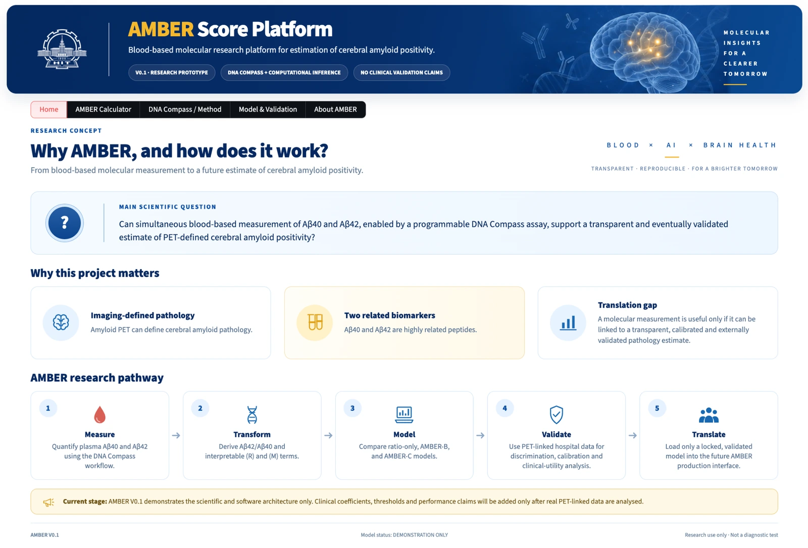
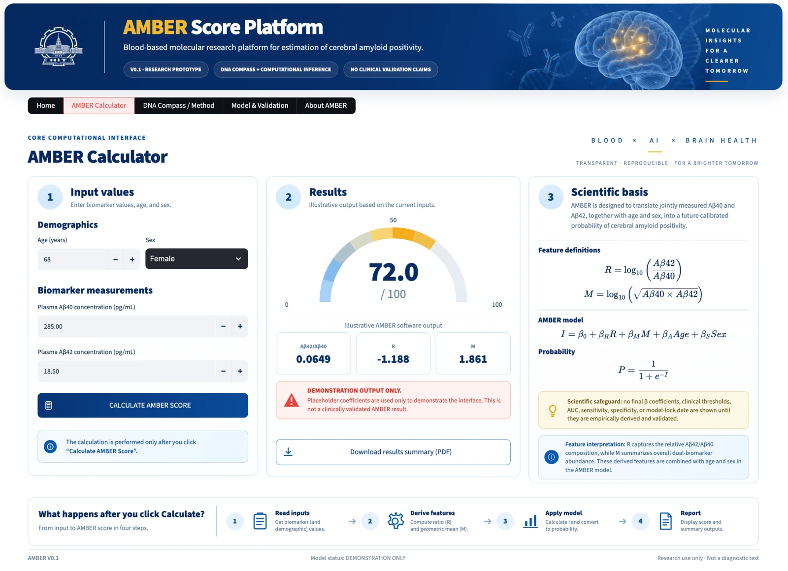
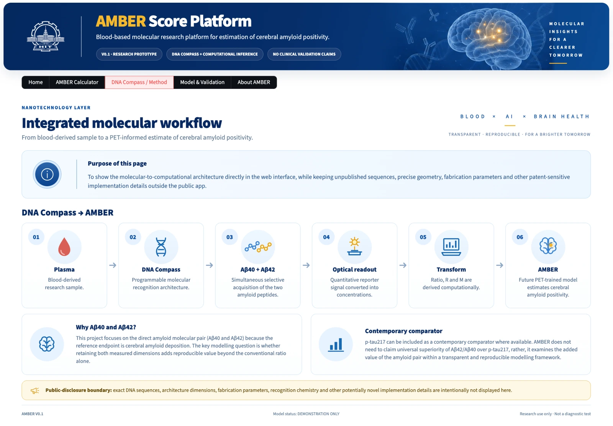
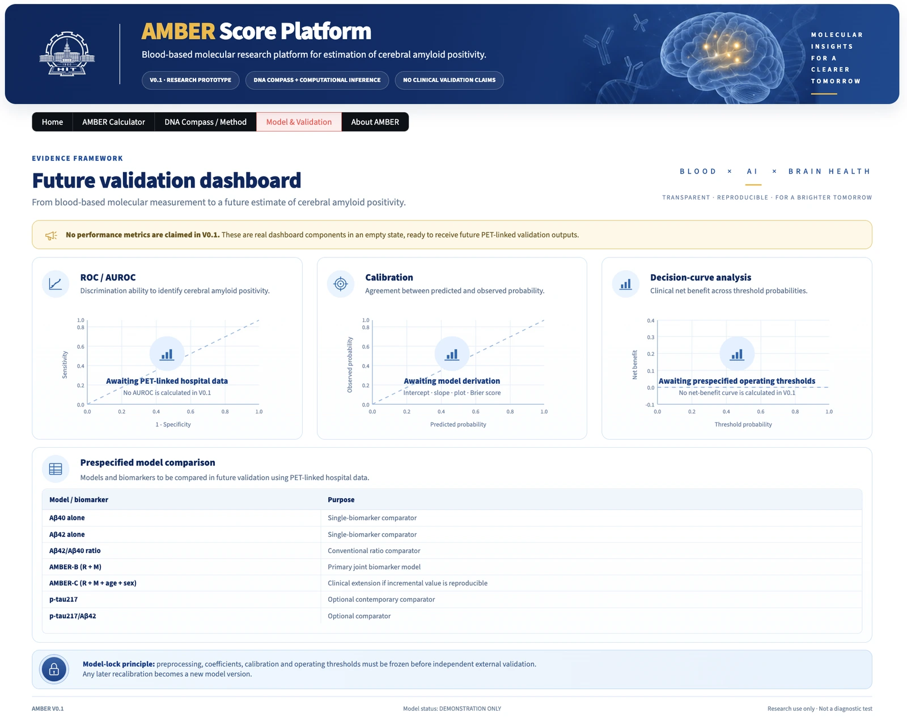
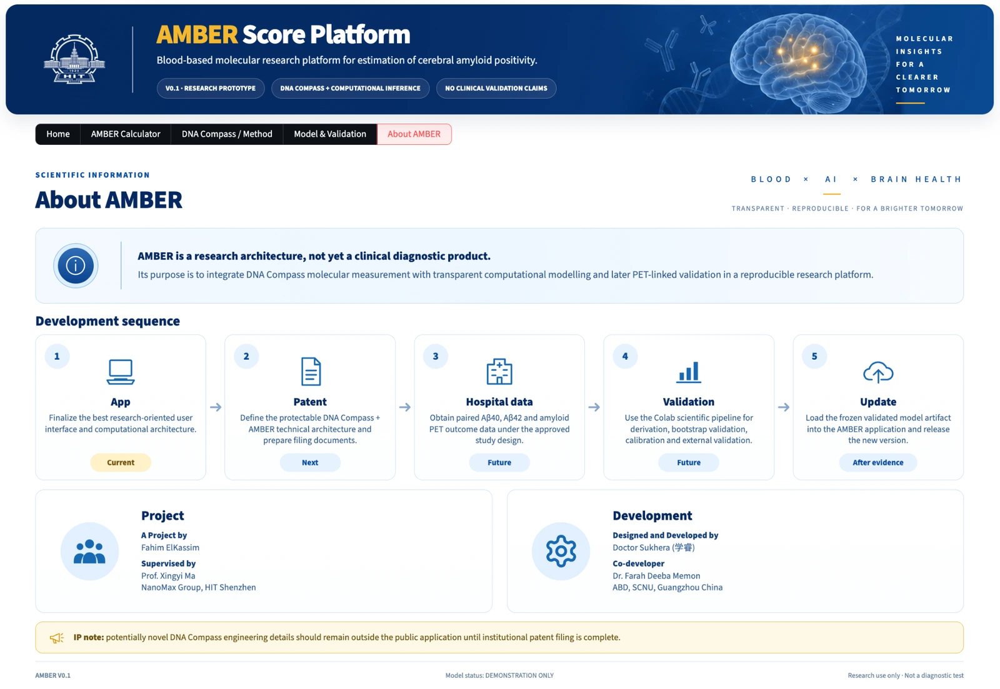

# AMBER Score Platform

<p align="center">
  <strong>Blood-based molecular research platform for estimation of cerebral amyloid positivity.</strong>
</p>

<p align="center">
  <a href="https://amber-v01.streamlit.app/"></a>
  
  
  
  
</p>

<p align="center">
  <a href="https://amber-testing.streamlit.app//"><strong>Open the AMBER V0.1 research prototype →</strong></a>
</p>



## Overview

**AMBER (Amyloid Blood Evaluation and Risk)** is a research architecture that links blood-based molecular measurement to transparent computational inference of **cerebral amyloid positivity/pathology**.

The platform is being developed around a high-level workflow:

**plasma Aβ40 + Aβ42 measurement → derived amyloid features → AMBER computational model → PET-linked validation → locked research deployment**

AMBER V0.1 is a **software and research-interface prototype**. It is not a stand-alone diagnostic test and does not contain clinically derived AMBER coefficients, validated decision thresholds, or claimed clinical performance.

## Scientific concept

The current interface accepts:

- plasma Aβ40 concentration
- plasma Aβ42 concentration
- age
- sex

The software derives:

- **Aβ42/Aβ40**
- **R = log10(Aβ42/Aβ40)**
- **M = log10(√(Aβ40 × Aβ42))**

The present score display uses **placeholder coefficients only for interface demonstration**. Final coefficients, calibration, thresholds, and performance metrics must be derived from outcome-labelled PET-linked hospital data and independently validated before any clinical interpretation.

## Why this project matters

AMBER is designed around three connected research questions:

1. **Molecular acquisition** — can a programmable DNA Compass workflow support quantitative acquisition of the closely related plasma amyloid peptides Aβ40 and Aβ42?
2. **Information preservation** — does retaining both biomarker dimensions provide reproducible value beyond the conventional Aβ42/Aβ40 ratio alone?
3. **Pathology-linked inference** — can the measured molecular information ultimately be translated into a calibrated estimate of PET-defined cerebral amyloid pathology?

## Application pages

### 1. Home

Research rationale, scientific question, and the AMBER development pathway.


### 2. AMBER Calculator

Research interface for biomarker/demographic input, derived feature calculation, illustrative score display, and PDF summary export.



### 3. DNA Compass / Method

High-level molecular-to-computational workflow while deliberately excluding patent-sensitive engineering implementation details.



### 4. Model & Validation

A future validation dashboard prepared to receive PET-linked model-development outputs such as discrimination, calibration, and decision-curve analyses after legitimate clinical derivation.



### 5. About AMBER

Project development sequence, contributors, current research status, and intellectual-property boundary.



## Development sequence

| Stage | Status | Purpose |
|---|---|---|
| App | **Current** | Finalize the research-oriented interface and computational architecture |
| Patent | **Next** | Define and protect the potentially novel DNA Compass + AMBER technical architecture |
| Hospital data | Future | Obtain paired Aβ40, Aβ42 and amyloid PET outcome data |
| Validation | Future | Derivation, bootstrap validation, calibration, model locking and external validation |
| Update | After evidence | Load the frozen validated model artifact into AMBER |

## Planned validation framework

When real PET-linked hospital data are available, the scientific pipeline is intended to evaluate:

- Aβ40 alone
- Aβ42 alone
- Aβ42/Aβ40 ratio
- joint biomarker modelling
- age/sex extension where justified by reproducible incremental value
- p-tau217 and p-tau217/Aβ42 as contemporary comparators where available

Planned reporting includes discrimination, calibration, Brier score, confidence intervals, decision-curve analysis, threshold performance, subgroup robustness, and independent external validation.

## Run locally

```bash
git clone https://github.com/DoctorSukhera/AMBER-V01.git
cd AMBER-V01
python -m venv .venv
source .venv/bin/activate   # Windows: .venv\Scripts\activate
pip install -r requirements.txt
streamlit run app.py
```

## Repository structure

```text
AMBER-V01/
├── app.py
├── requirements.txt
├── README.md
├── LICENSE
├── NOTICE.md
├── CITATION.cff
├── .gitignore
├── assets/
│   ├── amber_header_science.png
│   ├── hitsz_logo.png
│   └── hitsz_logo_white.png
└── docs/
    └── images/
        ├── 00-amber-platform-overview.webp
        ├── 01-home.webp
        ├── 02-calculator.webp
        ├── 03-dna-compass-method.webp
        ├── 04-model-validation.webp
        └── 05-about-amber.webp
```

## Project team

**A Project by**  
Fahim ElKassim

**Supervised by**  
Prof. Xingyi Ma  
NanoMax Group, HIT Shenzhen

**Designed and Developed by**  
Doctor Sukhera（学睿）

**Co-developer**  
Dr. Farah Deeba Memon  
ABD, SCNU, Guangzhou China

## Research-use and clinical disclaimer

AMBER V0.1 is provided for **research, software-development, and interface-demonstration purposes only**.

It is **not**:

- a diagnosis of Alzheimer's disease
- a stand-alone clinical diagnostic test
- a substitute for PET, CSF testing, or clinical assessment
- a validated source of clinical risk thresholds or performance claims

The current demonstrator must not be used for patient management or clinical decision-making.

## Intellectual-property boundary

The public repository intentionally does **not** disclose potentially patent-sensitive DNA Compass implementation details such as exact DNA sequences, architecture dimensions, fabrication parameters, recognition chemistry, or other unpublished engineering specifications.

Public disclosure should remain coordinated with institutional intellectual-property review and patent strategy.

## Data privacy

Do **not** commit patient-level hospital data, identifiable health information, medical-record numbers, or private clinical datasets to this repository.

Future validation data should be de-identified and handled under the relevant institutional approvals and data-governance requirements.

## Citation

A machine-readable citation file is included as [`CITATION.cff`](CITATION.cff).

## License

This repository is currently distributed as a research prototype under an **all-rights-reserved research license**. See [`LICENSE`](LICENSE).

---

<p align="center">
  <strong>AMBER V0.1 · Research Prototype · Demonstration Only</strong><br>
  Research use only · Not a diagnostic test
</p>
